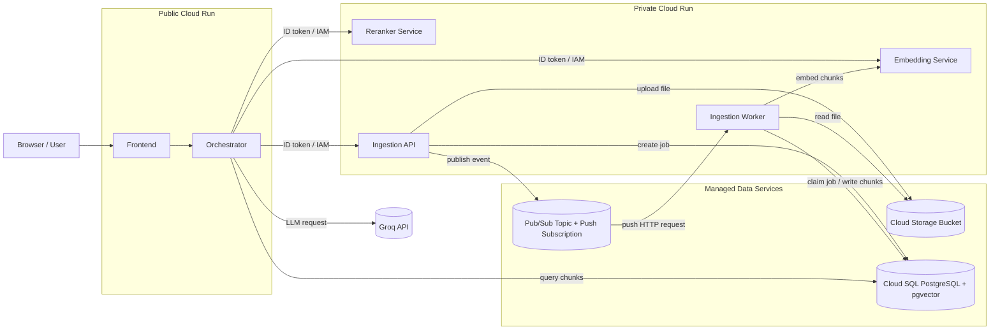

# GCP Deployment Overview

This document describes how the decoupled RAG system is deployed on Google Cloud Platform, how the services talk to each other, and how IAM, Cloud Storage, Pub/Sub, Cloud SQL, and Cloud Run are configured.



## 1. System Topology

The system is split into public and private Cloud Run services so the browser only talks to one public entrypoint, and all internal service calls happen server-to-service with IAM.

```text
Browser
  -> Frontend (public Cloud Run)
  -> Orchestrator (public Cloud Run)
      -> Embedding service (private Cloud Run)
      -> Reranker service (private Cloud Run)
      -> Ingestion service API (private Cloud Run)
          -> Cloud Storage bucket for uploaded files
          -> Cloud SQL PostgreSQL for job metadata and document chunks
          -> Pub/Sub topic for ingestion events
      -> Groq API (external)

Pub/Sub push subscription
  -> Ingestion worker (private Cloud Run HTTP service)
      -> Cloud SQL PostgreSQL
      -> Cloud Storage bucket for uploaded files
      -> Embedding service (private Cloud Run)
```


## 2. Cloud Run Services

### Public services

These are reachable from the internet:

- **Frontend**: serves the browser UI.
- **Orchestrator**: public API used by the frontend. It is the only backend service the browser should call directly.

### Private services

These services should not be publicly callable:

- **Embedding service**: called only by the orchestrator and ingestion worker.
- **Reranker service**: called only by the orchestrator.
- **Ingestion service API**: called only by the orchestrator.
- **Ingestion worker**: called by Pub/Sub push delivery, not by the browser.

### Access model

Private Cloud Run services use:

- `--no-allow-unauthenticated`
- a dedicated service account for each runtime service
- `SERVICE_AUTH_MODE=gcp_id_token`
- ID token authentication from the caller to the callee

That means the caller includes a Google-signed identity token in the `Authorization` header and the target Cloud Run service grants `roles/run.invoker` to the calling service account.

## 3. Service Accounts and IAM

### Recommended runtime service accounts

Use separate service accounts for each layer:

- **frontend service account**: usually not needed unless the frontend makes backend calls from server-side code.
- **orchestrator runtime service account**: calls embedding, reranker, and ingestion API.
- **ingestion API service account**: writes uploaded files to Cloud Storage, creates ingestion jobs, and publishes Pub/Sub messages.
- **ingestion worker service account**: receives Pub/Sub push requests, reads uploaded files, writes embeddings and chunks, and updates job status.

### IAM bindings

#### Orchestrator

Grant the orchestrator runtime service account `roles/run.invoker` on:

- embedding service
- reranker service
- ingestion service API

#### Ingestion API

Grant the ingestion API service account:

- `roles/storage.objectAdmin` or a narrower bucket-level role on the upload bucket
- `roles/pubsub.publisher` on the project or topic
- `roles/cloudsql.client` if it connects to Cloud SQL through the Cloud SQL connector
- `roles/run.invoker` if it needs to call any other Cloud Run service

#### Ingestion worker

Grant the ingestion worker service account:

- `roles/run.invoker` on the worker service itself for Pub/Sub push authentication
- `roles/pubsub.subscriber` if you ever switch to pull delivery
- `roles/storage.objectViewer` or bucket-level read access to the upload bucket
- `roles/cloudsql.client` for Cloud SQL access
- `roles/run.invoker` on the embedding service

### Pub/Sub push authentication

For the worker, Pub/Sub sends authenticated HTTP requests to the worker endpoint using a dedicated service account such as `ingestion-worker-sa@...`. Cloud Run verifies the request and only allows the push delivery identity if that service account has `roles/run.invoker` on the worker service.

## 4. Cloud SQL PostgreSQL

Cloud SQL is the persistence layer for:

- ingestion job records
- document chunks
- embeddings
- search metadata

### Database usage

The code uses PostgreSQL with `pgvector` enabled. The important tables are:

- `ingestion_jobs`: tracks file upload, job status, attempts, and errors
- `documents`: stores chunks plus `embedding_128` and `embedding_768`

### Connection pattern

Cloud Run services connect to Cloud SQL using the Cloud SQL connector / instance attachment:

- `--add-cloudsql-instances PROJECT:REGION:INSTANCE`
- `DATABASE_URL` points to the Cloud SQL socket path

Example:

```text
postgresql://postgres:<password>@/ragdb?host=/cloudsql/matryoshka-search:asia-south1:rag-postgres
```

### Required roles

The runtime service account that connects to Cloud SQL needs `roles/cloudsql.client`.

## 5. Cloud Storage

Cloud Storage is used to store uploaded source files.

### What is stored

When a user uploads a `.txt` or `.md` file:

- ingestion API uploads the file bytes to the bucket
- the `gs://` path is stored in the database job row
- the worker later downloads the file from the bucket and chunks it

### Bucket access

The ingestion API and worker service accounts need permission to access the bucket.

Typical roles:

- `roles/storage.objectAdmin` for the service that writes uploads
- `roles/storage.objectViewer` for the service that only reads uploads

### Why the file is stored in GCS

Cloud Run instances are ephemeral. The uploaded file must live outside the container so the worker can pick it up later and so restarts do not lose data.

## 6. Pub/Sub Flow

Pub/Sub is the event trigger for ingestion processing.

### Flow

1. The orchestrator receives a file upload from the browser.
2. The orchestrator proxies the file to the ingestion API.
3. The ingestion API uploads the file to Cloud Storage.
4. The ingestion API creates an `ingestion_jobs` row in Cloud SQL.
5. The ingestion API publishes a Pub/Sub message with `job_id`, `filename`, and `storage_path`.
6. Pub/Sub push delivers the message to the worker HTTP endpoint.
7. The worker claims the job in Cloud SQL, downloads the file from GCS, chunks it, calls the embedding service, and writes document rows.
8. The worker marks the job completed or failed.

### Topic and subscription

Suggested names:

- topic: `ingestion-jobs`
- subscription: `ingestion-jobs-sub`

In the current push-based setup, the subscription uses a push endpoint pointing at the worker Cloud Run service.

## 7. Ingestion Worker Model

The worker is deployed as a normal Cloud Run container image, but it runs a FastAPI app rather than a long-lived background process.

### Why this is the Cloud Run-friendly design

Cloud Run services are HTTP services. A forever-running pull subscriber is a poor fit because Cloud Run expects the container to respond to requests on `$PORT`.

The worker therefore exposes an HTTP endpoint such as:

- `POST /pubsub/ingest`

Pub/Sub push calls this endpoint and the worker processes one job per message.

### Job deduplication and retries

Pub/Sub can retry messages. To avoid duplicate processing:

- the worker first atomically claims the job row in PostgreSQL
- if the job is already processing or completed, the worker ignores the duplicate delivery
- the worker only marks the job complete after chunking and embedding finish successfully

## 8. Public vs Private Access

### Public Cloud Run

The frontend and orchestrator are public because:

- the browser needs a reachable entrypoint
- the orchestrator acts as the system boundary for the frontend

### Private Cloud Run

The inference and ingestion backends are private because:

- they should not be directly exposed to the browser
- they should only accept authenticated service-to-service traffic
- this reduces accidental CORS and auth problems

### Browser access rule

The browser should only call the frontend and, optionally, the orchestrator API. It should not call the embedding, reranker, or ingestion services directly.

## 9. Deployment Sequence

A clean deployment order is:

1. Create Cloud SQL PostgreSQL and enable `pgvector`.
2. Create the Cloud Storage bucket for uploads.
3. Create the Pub/Sub topic and subscription.
4. Create the runtime service accounts.
5. Grant IAM roles to those service accounts.
6. Build and push container images.
7. Deploy the private services first.
8. Deploy the orchestrator.
9. Deploy the frontend.
10. Verify upload -> Pub/Sub -> worker -> DB flow.

## 10. Example Cloud Run Environment Variables

### Orchestrator

- `DATABASE_URL`
- `EMBEDDING_SERVICE_URL`
- `RERANKER_SERVICE_URL`
- `INGESTION_SERVICE_URL`
- `SERVICE_AUTH_MODE=gcp_id_token`
- `GROQ_API_KEY`
- `GROQ_MODEL`
- `CORS_ALLOW_ORIGINS`

### Ingestion API

- `DATABASE_URL`
- `EMBEDDING_SERVICE_URL`
- `SERVICE_AUTH_MODE=gcp_id_token`
- `GCS_BUCKET`
- `GCP_PROJECT_ID`
- `PUBSUB_TOPIC_NAME`
- `PUBSUB_SUBSCRIPTION_NAME`

### Worker

- `DATABASE_URL`
- `EMBEDDING_SERVICE_URL`
- `SERVICE_AUTH_MODE=gcp_id_token`
- `GCS_BUCKET`
- `GCP_PROJECT_ID`
- `PUBSUB_TOPIC_NAME`
- `PUBSUB_SUBSCRIPTION_NAME`

## 11. Example Image-Based Deployment Pattern

If you deploy with prebuilt images, the pattern is:

```bash
gcloud run deploy ingestion-service \
  --image asia-south1-docker.pkg.dev/matryoshka-search/rag-search/ingestion \
  --no-allow-unauthenticated \
  --memory 512Mi \
  --cpu 1 \
  --region asia-south1 \
  --service-account ingestion-sa@matryoshka-search.iam.gserviceaccount.com \
  --set-secrets DB_PASSWORD=db-password:latest \
  --set-env-vars EMBEDDING_SERVICE_URL=$EMBEDDER_URL \
  --set-env-vars SERVICE_AUTH_MODE=gcp_id_token \
  --set-env-vars DATABASE_URL="postgresql://postgres:$(gcloud secrets versions access latest --secret=db-password)@/ragdb?host=/cloudsql/matryoshka-search:asia-south1:rag-postgres" \
  --set-env-vars GCS_BUCKET=matryoshka-search-uploads \
  --set-env-vars GCP_PROJECT_ID=$PROJECT_ID \
  --set-env-vars PUBSUB_TOPIC_NAME=ingestion-jobs \
  --set-env-vars PUBSUB_SUBSCRIPTION_NAME=ingestion-jobs-sub \
  --add-cloudsql-instances matryoshka-search:asia-south1:rag-postgres
```

That same pattern works for the worker image too, as long as the worker container exposes HTTP and Pub/Sub push is configured to call it.

## 12. What the Browser Never Sees

The browser never directly talks to:

- Cloud SQL
- Cloud Storage
- Pub/Sub
- embedding service
- reranker service
- ingestion worker

Those are all internal backend dependencies.

## 13. Good Interview Summary

A short summary of the architecture is:

- public frontend calls a public orchestrator
- orchestrator talks to private services using IAM-authenticated ID tokens
- ingestion API uploads files to Cloud Storage and emits Pub/Sub events
- Pub/Sub push triggers a private Cloud Run worker
- worker processes the file, writes chunks and embeddings to Cloud SQL, and marks job state
- Cloud SQL stores both document chunks and ingestion metadata
- Cloud Storage stores the source files so the worker can process them asynchronously

## 14. Notes and Caveats

- The ingestion API and worker should use separate service accounts.
- If you use Pub/Sub push, the worker should be an HTTP service, not a background subscriber.
- If you later want a true background worker, use Compute Engine, GKE, or a queue system that fits long-lived processes better.
- This document reflects the current repo direction: orchestrator-driven public access and private backend services with IAM-authenticated service-to-service traffic.
